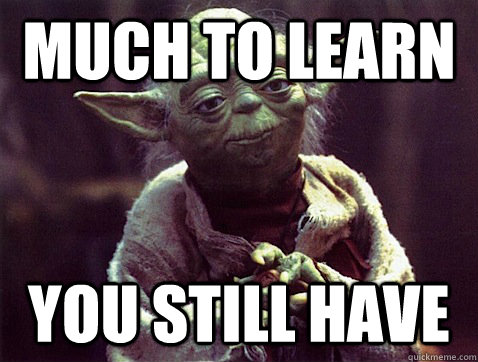
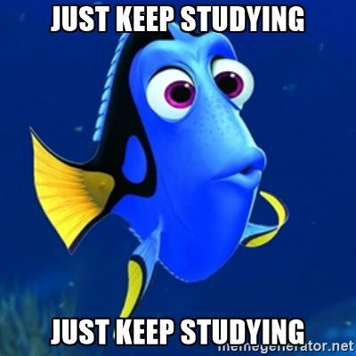

# 
Entry 2: CodeAcademy

In order to grow my knowledge of <b>React JS</b>, 
I continued to take courses on <em>CodeAcademy</em>. The practice examples, important lessons,
and quizzes provided by <em>CodeAcademy</em> were extremely helpful in the process of learning and becoming more comfortable with the language. 

When I began my second week of independent study, I was only scratching the surface of what <b>React JS</b> can really do. 
This week was dedicated to growing my knowledge of the basics, as well as, discovering some projects that could be 
developed utilizing <b>React JS</b>.

### <strong>Takeaways</strong>
<ul>
    <li>Whenever you are faced with something you do not understand, to
    make it easier, it is helpful to <b>break it down</b>. 
    Step by step is the way to go! <b>Every step matters, no matter how small</b>.
    In terms of coding,
    I found that it is beneficial to break apart each line of code and analyze it
    so that I can better understand the meaning or purpose of each part.
    </li>
    <li><b>Practice, Practice, Practice!</b> The more you practice, the more you know.
    The more you know, the more you grow.</li>
</ul>

