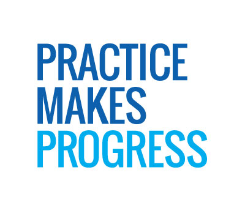

# <center>Entry 3: Tinker, Tinker, Tinker!</center>


<p>During this week of independent study, I continued to learn React JS through Codecademy, and then decided to tinker around with an example code found on CodePen. It is during my search of a simple example utilizing React JS that I found the site Code Pen, which is similar to the website JSbin that I had used previously in my software engineering class. </p>
<br>
<p>After searching through many different websites or examples in order to find a project that utilized only React JS, rather than a combination of react js and other languages, I found a basic to do list project. I utilized the project in order to test out what could be created with react js and to get more practice coding with the language. When looking over the code, I tried commenting out certain lines of code do identity its purpose, as well as, changed certain values in order to get a better sense of how the code worked. I tried breaking it down line by line in order to comprehend the importance and function of every line. </p>

#### HTML

```html
<div id="todo">
  <!-- This is where React will work its magic -->
</div>
```

<p>This is the place in the html where the javascript will render, in other words, the to do list will be displayed within this div</p>

```javascript
<script type="text/jsx">
    /** @jsx React.DOM */

    var TodoBanner = React.createClass({
      render: function(){
        return (
          <h3>Todo List</h3>
        );
      }
    });
```
<p>This begins using react js. This code refers to the banner or heading on top of the to do list</p>

```javascript
 var TodoList = React.createClass({
      render: function() {
      var createItem = function(itemText) {
        return (
            <TodoListItem>{itemText}</TodoListItem>
          );
      };
      return <ul>{this.props.items.map(createItem)}</ul>;
      }
    });
```

<p>This code works to create individual items. It returns the item itself in a bulleted form.</p>

```javascript
    var TodoListItem = React.createClass({
      render: function(){
        return (
          <li>{this.props.children}</li>
        );
      }
    });
```

<p>This code works to create a list consisting of the to do list items </p>

```javascript
    var TodoForm = React.createClass({
      getInitialState: function() {
        return {item: ''};
        },
```

<p>This code works on the form or text box to insert a new item to the list.</p>

```javascript
      handleSubmit: function(e){
        e.preventDefault();
        this.props.onFormSubmit(this.state.item);
        this.setState({item: ''});
        React.findDOMNode(this.refs.item).focus();
        return;
      },
```
<p>This code works to return the user input of the item </p>

```javascript
      onChange: function(e){
        this.setState({
          item: e.target.value
        });
      },
      render: function(){
        return (
          <form onSubmit={this.handleSubmit}>
            <input type='text' ref='item' onChange={this.onChange} value={this.state.item}/>
            <input type='submit' value='Add'/>
          </form>
        );
      }
    });	
```

<p>The value of the user input, or item, will be added to the to do list and displayed on screen using render</p>

```javascript
    var TodoApp = React.createClass({
      getInitialState: function() {
      return {items: ['Todo item #1', 'Todo item #2']};
      },
```

<p>This code makes the initial state of the to do list have two bullet points already that say Todo item#1 and Todo item #2</p>

```javascript
      updateItems: function(newItem) {
        var allItems = this.state.items.concat([newItem]);
        this.setState({
        items: allItems
      });
      },
```

<p>When a new item is added, the to do list will update to include that new item</p>

```javascript
      render: function() {
      return (
        <div>
        <TodoBanner/>
        <TodoList items={this.state.items}/>
        <TodoForm onFormSubmit={this.updateItems}/>
        </div>
      );
      }
    });

    React.renderComponent(<TodoApp/>, document.getElementById('todo'));
</script>
```


#### CSS

```css
h3 {
  background: #1B3D24;
  text-align: center;
  color: white;
  padding: 5px 0;
}
input[type=text] {
  border: 1px solid #ccc;
  padding: 7px 5px;
  width: 150px;
  font-size: 14px;
}
input[type=submit] {
  border: 1px solid #ccc;
  margin-left: 15px;
  padding: 5px 15px;
/*   font-size: 1em; */
}
#todo {
  background-color: whitesmoke;
/*   border-radius: 3px; */
/*   padding: 0 15px 15px; */
  width: 250px;
  margin: 5em auto;
/*   border: 1px solid #ddd; */
}```

<p>Next, I would like to learn how to create a more complex example or possibly add on to this to do list. For example, figuring out how to use react js to make it so that items can be checked off or crossed off the to do list. </p>

### Takeways
<ul>
	<li>Do not be discouraged if you do not understand something at first.<strong>Persevere!</strong> It is okay to be a beginner. It is okay to be confused, just as long as you do not give up and allow yourself to be a beginner or take time to learn or understand something</strong></li>
	<li>There is no one way or right way to learn, use what works for you or what enables you to comprehend the most information</li>
	<li>What is most important is not how much you know, but what you <strong>DO</strong> with what you know. I utilized basic knowledge learned from Codecademy to tinker with a simple react js project. Through tinkering, I was able to learn more or enhance my comprehension of the topic. I also started off with a simple project so as not to overwhelm myself or to prevent myself from stepping into the <em>Panic Zone</em> </li>
</ul>



### Resources
<ul>
    <li>Codecademy</li>
    <li>http://codepen.io/anon/pen/JWgRvB</li>
    <li>http://pankajparashar.com/posts/todo-app-react-js/</li>
<ul>


