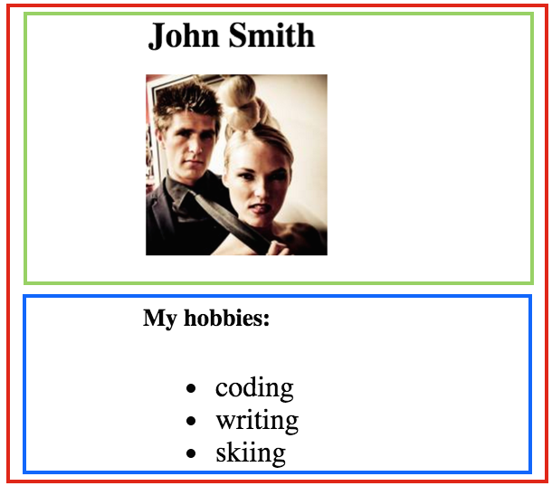

# <center>Entry 4: Learn and Tinker</center>

<p>Throughout the week, I continued learning on Codecademy, but then I decided to switch learning gears and try coding a small project to better understand React JS. I was still confused on what exactly could be created using React JS, so I searched through many articles and examples online until I found an article with a step by step tutorial on making a simple React JS project. </p>

<p>I started with the view of the intended outcome:</p>

<p>And with the information that everything on this page was part of a component. The article taught me to look for the main component or what everything else is inside of and then to visualize it in a different way:</p>
<br>
<ul>
<li>App</li>
    <ul>Profile</ul>
	<ul>Hobbies</ul>
</ul>
<br>

<p>I was currently learning about components in React JS, and when I found the tutorial online, the project reinforced the topics I was learning on Codecademy. Visualizing the information of Codecademy or seeing the code in action so to speak, was extremely helpful in my understanding of the language. </p>

<p>From the tutorial, I was able to become familiar with coding React JS in Cloud9. The article provided me with a coding template to clone into my own workspace. I also learned how to code React JS within an HTML page or that the React JS code belongs in between these tags:</p>

```html
<script type="text/jsx">
</script>

```


<p>I also learned, from both Codecademy and the tutorial, that</p>

```
React.createClass()
```
<p>creates a component</p>

<p>The project within the tutorial utilizes data from another source, or made me realize that I could use APIs, a previously learned topic, as the data a React JS project could take in </p>

<p>I also learned that data in React JS follows a one directional flow, or is transferred from the parent to child components. So this code:</p>

```javascript
<Profile
name={this.props.profileData.name} 
imgURL={this.props.profileData.imgURL}/>
<Hobbies
hobbyList={this.props.profileData.hobbyList} />
```

<p>defines a path for the data or makes the data from App pass down to its children</p>

<br>
<p>Overall, coding a project in React JS allowed me to better prepare myself, as well as, gain inspiration for, the creation of my final project. </p>
<br>

### <strong>Takeaways</strong>

<ul>
<li>I found it helpful to try to <b>break an idea down</b> in order to better understand it, as well as, to try and <b>visualize</b> it or utilize <b>images and diagrams</b> to increase comprehension</li>

<li>Now, this tip may not be for everyone and some people may be the type of learner that enjoys diving head first into the unknown and then learning how to swim, but personally, I like to take <b>baby steps</b> or <b>try not to bite off more than I can chew</b>. I decided that starting off coding simple examples would help me the best, which brings me to my next takeaway…</li>

<li><b>Explore</b> different learning methods and try to <b>find what works for you</b> or what type of learner you are</li>

</ul>

### <strong>Resources:</strong>
https://medium.com/learning-new-stuff/building-your-first-react-js-app-d53b0c98dc