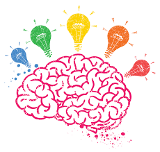
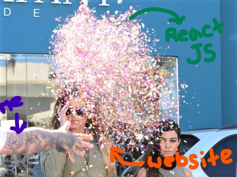
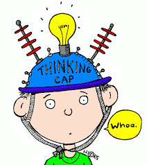

# <center>Entry 5: Component Interaction and Final Project Brainstorm</center>
<h3>Component Interaction</h3>
<p>Through Codecademy tutorials, I learned a lot about component interaction. For instance, a component can interact with another component in two ways: </p>
<ol>
	<li>A component can render another component, like so:</li>

```javascript
ReactDOM.render(<NavBar />)
```
<p>Within profilepage.js this line of code is inserted so that the Navbar file is rendered</p>

  <li>A component can also pass data to another component</li>

<p>The information that is passed between components is called “props”</p>
<p>Information is passed between components by giving a component an attribute or name, such as:</p>

```javascript
 <Greeting name="Meagan"/>
```
<p>Greeting is the file name or one component and this line of code is placed within another component, the file named app. This way, Greeting can run its code with the name input of Meagan. The data shared between the two components is the name. </p>
<p>While coding this example in Codecademy, I was also thinking of how this could work with a gets.chomp in order to take in an input saved to the attribute or value of a name and utilize the user’s name with react js code in order to get the screen to render a personalized greeting. </p>
<p> The sharing of data or component interaction in react js also reminded me of the interaction between classes in ruby</p>
</ol>
<br>
<p>I also learned about module.exports or how it is used to grab a specific component in a file. It comes from Node.js, which require comes from as well. However, after reading the information on Codecademy, I was still confused on the function or purpose of module.exports so I decided to look at online articles to help me understand the concept a bit better. Just seeing the definition of <code>modules.exports</code> in a different way helped the information click for me. I realized that <code>modules.exports</code> is the object that is returned after a <code>require</code> call.
</p>

<h3>Tinkering</h3>
<p>After learning for a couple days on Codecademy, I decided to increase my comprehension of the topic through tinkering with practice examples. While I was searching for inspiration for something to make for my final project, I stumbled upon small coding examples, such as a timer that recorded the time elapsed. I decided to play around with that code to turn it into a timer that counts down.  </p>
<h3>Original Code</h3>

```javascript
class Timer extends React.Component {
  constructor(props) {
    super(props);
    this.state = {secondsElapsed: 0};
  }

  tick() {
    this.setState((prevState) => ({
      secondsElapsed: prevState.secondsElapsed + 1
    }));
  }

  componentDidMount() {
    this.interval = setInterval(() => this.tick(), 1000);
  }

  componentWillUnmount() {
    clearInterval(this.interval);
  }

  render() {
    return (
      <div>Seconds Elapsed: {this.state.secondsElapsed}</div>
    );
  }
}

ReactDOM.render(<Timer />, mountNode);
<br>
```
<h3>Tinkered Code</h3>

```javascript
class Timer extends React.Component {
  constructor(props) {
    super(props);
    this.state = {timeLeft: 60};
  }

  tick() {
    this.setState((prevState) => ({
      timeLeft: prevState.timeLeft - 1
    }));
  }

  componentDidMount() {
    this.interval = setInterval(() => this.tick(), 1000);
  }

  componentWillUnmount() {
    clearInterval(this.interval);
  }

  render() {
    return (
      <div>Time Remaining (seconds): {this.state.timeLeft}</div>
    );
  }
}

ReactDOM.render(<Timer />, mountNode);
```

<h3>Brainstorm</h3>

<p>I had recently created a Book-o-mmender web app in ruby with my partners Raveena Suman and Mei Ting Ieong, which was a project that I was very proud of and one that successfully combined a knowledge of ruby with my love for books :) I thought that utilizing this project and adding react js elements to it might be a good idea for a final project. </p>
<p>I could sprinkle some react js on my Book-o-mmender website</p>

<p>I could possibly add react js animations, a gradual change of the background color 
tintor an insertion of  a map so users could find book stores near them.</p>


<h3>Takeaways</h3>
<ul>
    <li>When trying to come up with an idea for a project, try utilizing your learned knowledge with your <b>interests</b> or <b>passions</b></li>
    <li>To reinforce information you learn, I find it helpful to look at many <b>different resources</b>. For instance, when I had to refer to other articles to increase my understanding of a topic learned on Codecademy</li>
    <li><b>Practice makes Progress.</b> It is helpful to read information or follow tutorials, but to complement that type of learning, try tinkering or coding examples</li>
</ul>
<h3>Resources</h3>

http://stackoverflow.com/questions/5311334/what-is-the-purpose-of-node-js-module-exports-and-how-do-you-use-it

https://facebook.github.io/react/