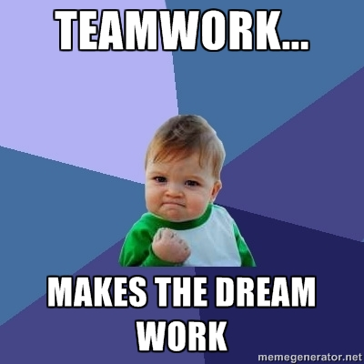

# <center>Entry 5: Book-o-mmender Brainstorm</center>
<p>After completing a few lessons on Codecademy to continue growing my knowledge of React JS, I decided to look at various articles to find inspiration for my final project. I wanted to see what React JS components I could add to my previously made Book-o-mmender app. My partners for this previous project, Mei Ting and Raveena, helped me to decide what to make for the final project. Utilizing the knowledge we all learned in our independent studies, we plan on collaborating to add a book wish list or Book-o-bag for users to keep track of the books they want to read.</p> 

[Link to the Book-o-mmender app](http://book-o-mmender.herokuapp.com)

<p> In order to prepare for this final project, I decided it would be best for me to break down my ideas to plan out what will need to be coded. </p>

<ul>
	<li>Create a navbar on the results page with a cart icon that, when clicked, will send the user to a page with their Book-o-bag/book  wish list (numbered list with book titles/ image covers/ description) </li>
		<ul>On the NavBar, the title of the app (Book-o-mmender would be to the left (float: left) and the cart icon would be to the right (float: right)</ul>
	<li>On the results page, next to each recommended book, there should be a plus icon that, when clicked, adds that book to the user’s Book-o-bag</li>
		<ul>When the user clicks on the plus icon there should be some sort of notification that alerts the user that the book title has been added
		to their Book-o-bag</ul>
	<li>Book-o-bag page could have fade in books from React JS animations (smooth fade in
	using React flip) I learned that react-flip is a way of using animations or makes a 
	component animate from one place to another without the use of measuring pixels because you 
	would have to simply assign a class name to a div and use that div as the location ex. </li>
</ul>

[react-flip](https://www.npmjs.com/package/react-flip)
<ul>
	<li> Utilizing React JS animation capabilities, I could create a book confetti animation that occurs whenever the user’s mouse hovers over the Book-o-bag icon</li>
</ul>

[Inspiration](http://swizec.github.io/react-particles-experiment/)

<p> From learning more about coding in React JS from Codecademy lessons,
I was able to find aspects of the language that could be useful when coding
my final project. For instance, my plans to make something happen when something 
is clicked or hovered over requires an event handler. It was helpful that this week,
I ended up learning about assigning and receiving event handlers in ReactJS. I found out 
that, in order to put an event handler on an object, you must follow a syntax such as this:

```javascript
      <h1 onClick={this.handleEvent}>
        Hello world
      </h1>
``` 
<p>I learned that event handler functions are passed as <code>props</code>, 
a concept in React JS that I had learned last week. When passing an event handler 
as a prop, I discovered that you must name the event handler, as well as, name the prop
that is used to pass the event handler. The prop name is usually a name such as, <code>onClick</code> or <code>onHover</code></p> 

<h3>Takeaways</h3>
<ul>
	<li>Planning before creating or making to do lists is a helpful tool for the organization of ideas or thoughts. List-making is helpful in making the process of getting started a little easier. </li>
	<li>Creating by yourself can be beneficial, but it is also fun and rewarding to collaborate with others. Every person has something they bring to the table and by combining every person’s knowledge or efforts, ideas can turn into realities and amazing things can be created. </li>

</ul>

