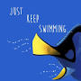
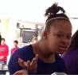

# <center>Entry 7: Just Keep Swimming </center>

<p>Throughout this week, I have continued to swim through the depths of the 
react js ocean. I have been continuing to plan, brainstorm, 
and work on my final project. I have been looking through many, many, many, many, many... many articles 
to find specific aspects of react js that I want to use for the Book-o-mmender website. 
I realized, since my last entry, that creating a new page for the Book-o-bag wishlist when an image on the 
navbar is clicked would result in more back end coding than react js calls for. 
So, I decided to stick to solely front end work with react js and, after the project is done, 
return to the code in order to add more functionality.  </p>
<p>The biggest struggle I had this week was figuring out how to code react js in c9. I had looked at many different 
articles stating how to install react js on c9, but every one I looked at was different in some way, leaving me 
very confused. </p>

<p>I decided to use my peers, who were also working on react js, as resources for assistance. However, in order to make more efficient use of my time, I decided to find and tinker with code in the meantime that I could use for the website. </p>
<p>For instance, the code below utilizes react js to create a button that, when 
clicked, alerts the user that the book next to that button has been added to their Book-o-Bag.</p>

```javascript
var ReactDOM = require('react-dom');

var Button = React.createClass({
  notify: function () {
    alert(“This book has been added to your Book-o-Bag.”);
  },

  render: function () {
    return <button onClick={this.notify}>Add to my Book-o-Bag.</button>;
  }
});
ReactDOM.render(<Button />, document.getElementById('app'))
```

### To Do List
- [ ] Create a Navbar on the Book-o-mmender website
- [ ] Add CSS to the NavBar
- [ ] Add a plus sign button to the website next to each recommended book 
- [ ] Make an alert notification after the plus sign is clicked
- [ ] Add CSS to the button 

### Takeaways
<ul>
    <li>A good tip to follow is to <b>get something to work first</b>, and then add more components later on.<b>Take it step by step, rather than focusing on accomplishing the big picture</b></li>
    <li><b>Challenges will arise</b> and it is helpful to 
    know when it is best for you to either face 
    those challenges head on or to take a step back and work on something else
    before tackling the issue.</li>
    <li>I find the best way to organize my thoughts and accomplish goals efficiently is to <b>make to do lists</b></li>

</ul>